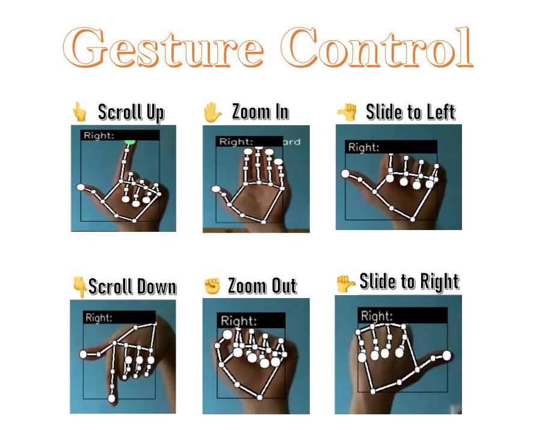

# Gesture control in Web Browser


1. Install Anaconda for python 3.9

	https://repo.anaconda.com/archive/Anaconda3-2022.10-Windows-x86_64.exe
	
	When install, please check “Add Anaconda…”

2. after install, please run command prompt

	Go to project folder in command prompt. And run this command

	pip install -r requirements.txt

3. run code

       python main.py
       

-------


### Gesture control 

Here is a full list of gestures that are available now.



## Adding new gestures
Hand recognition detector can add and change training data to retrain the model on the own gestures. But before this,
there are technical details of the detector to understand how it works and how it can be improved
### Technical details of gesture detector
Mediapipe Hand keypoints recognition is returning 3D coordinated of 20 hand landmarks. For our
model we will use only 2D coordinates.


Then, these points are preprocessed for training the model in the following way.


After that, we can use data to train our model. Keypoint classifier is a simple Neural network with such 
structure


_check [here](#Grid-Search) to understand how the architecture was selected_
### Creating dataset with new gestures
First, pull datasets from Git LFS. [Here](https://github.com/git-lfs/git-lfs/wiki/Installation) is the instruction of how 
to install LFS. Then, run the command to pull default csv files
```sh
git lfs install
git lfs pull
```

After that, run `main.py` and press "n" to enter the mode to save key points
(displayed as **MODE:Logging Key Point**）


If you press "0" to "9", the key points will be added to [model/keypoint_classifier/keypoint.csv](model/keypoint_classifier/keypoint.csv) as shown below.<br>
1st column: Pressed number (class ID), 2nd and subsequent columns: Keypoint coordinates


In the initial state, 7 types of learning data are included as was shown [here](#Gesture-control). If necessary, add 3 or later, or delete the existing data of csv to prepare the training data.
### Notebook for retraining model
[](https://colab.research.google.com/github/kinivi/tello-gesture-control/blob/main/Keypoint_model_training.ipynb)

Open [Keypoint_model_training.ipynb](Keypoint_model_training.ipynb) in Jupyter Notebook or Google Colab.
Change the number of training data classes,the value of **NUM_CLASSES = 3**, and path to the dataset. Then, execute all cells
and download `.tflite` model


Do not forget to modify or add labels in `"model/keypoint_classifier/keypoint_classifier_label.csv"`

#### Grid Search
❗️ Important ❗️ The last part of the notebook is an experimental part of the notebook which main functionality is to test hyperparameters of the model structure. In a nutshell: grid search using TensorBoard visualization. Feel free to use it for your experiments.


## Repository structure
<pre>
│  main.py
│  Keypoint_model_training.ipynb
│  config.txt
│  requirements.txt
│  
├─model
│  └─keypoint_classifier
│      │  keypoint.csv
│      │  keypoint_classifier.hdf5
│      │  keypoint_classifier.py
│      │  keypoint_classifier.tflite
│      └─ keypoint_classifier_label.csv
│ 
├─gestures
│   │  gesture_recognition.py
│   │  gesture_control.py
│   │  tello_gesture_controller.py
│   └─ tello_keyboard_controller.py
│          
│ 
└─utils
    └─cvfpscalc.py
</pre>
### app.py
Main app which controls the functionality of drone control and gesture recognition<br>
App also includes mode to collect training data for adding new gestures.<br>

### keypoint_classification.ipynb
This is a model training script for hand sign recognition.

### model/keypoint_classifier
This directory stores files related to gesture recognition.<br>

* Training data(keypoint.csv)
* Trained model(keypoint_classifier.tflite)
* Label data(keypoint_classifier_label.csv)
* Inference module(keypoint_classifier.py)

### gestures/
This directory stores files related to drone controllers and gesture modules.<br>

* Keyboard controller (tello_keyboard_controller.py)
* Gesture controller(tello_keyboard_controller.py)
* Gesture recognition module(keypoint_classifier_label.csv)

### utils/cvfpscalc.py
Module for FPS measurement.

# Reference
* [MediaPipe](https://github.com/google/mediapipe)
* [MediaPipe Hand gesture recognition (by Kazuhito00)](https://github.com/Kazuhito00/hand-gesture-recognition-using-mediapipe)
* [Tello SDK python interface](https://github.com/damiafuentes/DJITelloPy)

# Author
Eternal Vision(https://github.com/sharevision99)
 
# License 
tello-gesture-control is under [Apache-2.0 License](LICENSE).
